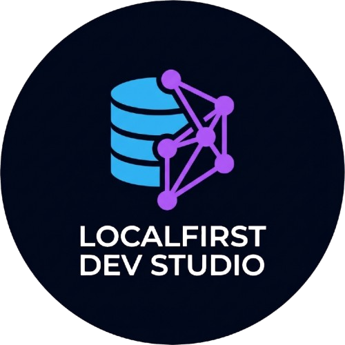

# LocalFirst Dev Studio 🚀



> **Privacy-first SQLite Database Viewer & ER Diagram Tool**  
> *Built with love using [Antigravity](https://antigravity.google)* 💖

[](https://opensource.org/licenses/MIT)
[](https://www.typescriptlang.org/)
[](https://reactjs.org/)
[](https://vitejs.dev/)
[](https://tailwindcss.com/)

**LocalFirst Dev Studio** is a secure, offline-capable web application for managing and visualizing SQLite databases directly in your browser. No data is ever uploaded to a server—everything stays on your device.

---

## ✨ Features

- **🔒 Local-First & Secure**: Your data never leaves your browser. We use `sql.js` (WASM) to process everything locally.
- **📂 Multi-Database Support**: Open and switch between multiple SQLite database files instantly.
- **📊 Interactive ER Diagrams**: Visualize your database schema with auto-generated, interactive Entity-Relationship diagrams.
- **📝 Powerful SQL Editor**: Write and execute queries with a responsive editor and results grid.
- **📱 Mobile Friendly**: Fully responsive design with a mobile-optimized interface.
- **🌗 Dark/Light Mode**: Beautiful UI that adapts to your system preferences.
- **⚡ PWA Ready**: Install as a native app on your device for offline access.

## 🛠️ Tech Stack

- **Frontend**: React, TypeScript, Vite
- **Styling**: Tailwind CSS, Lucide React (Icons)
- **Database**: `sql.js` (SQLite WASM), `idb` (IndexedDB)
- **Visualization**: React Flow, Dagre (Graph Layout)
- **State Management**: Zustand

## 🚀 Getting Started

### Prerequisites

- Node.js (v18 or higher)
- npm or yarn

### Installation

1. **Clone the repository**
   ```bash
   git clone https://github.com/Devloper-Download/platform.git
   cd platform
   ```

2. **Install dependencies**
   ```bash
   npm install
   ```

3. **Start the development server**
   ```bash
   npm run dev
   ```
   Open [http://localhost:5173](http://localhost:5173) in your browser.

### Building for Production

```bash
npm run build
```
The output will be in the `dist` directory, ready to be deployed to any static host (Vercel, Netlify, GitHub Pages).

## 🤝 Contributing

Contributions are welcome! Please feel free to submit a Pull Request.

1. Fork the project
2. Create your feature branch (`git checkout -b feature/AmazingFeature`)
3. Commit your changes (`git commit -m 'Add some AmazingFeature'`)
4. Push to the branch (`git push origin feature/AmazingFeature`)
5. Open a Pull Request

## 📄 License

This project is licensed under the MIT License - see the [LICENSE.md](LICENSE.md) file for details.

---

<div align="center">
  <sub>Built by <a href="https://github.com/Devloper-Download">Devloper Download</a></sub>
</div>
